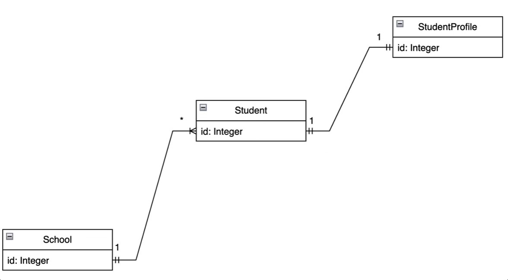

### Overview 
Despite already having knowledge about Java, and the development of simple and basic restful api's, using the spring framework, in other repo's, this server to restart learning, stopped in the last few months, due to other academic projects. 

The objective is to explore and better understand the mechanics of developing applications with these technologies, and learn more about the use of microservices and containers and the resources provided by the framework.

Speaking of this repository, it covers the theoretical part about beans, dependency injection, use of profiles, Spring Data JPA, development of a restful API, DTO patterns, Data validation, Test Isolation with Mockito, and so on.

## Project Info, Restful API
Develop a simple Restful Api, with 3 related entities, including:
Student, School, and Student Profile.

The architecture:

.

## Tecnologies & Tools 
Java 17, Postman, IntelliJ, PostgreSQL (by CMD & pgAdmin4), Spring Boot 3, Maven; 

## Dependencies 
Spring Boot, Spring Data JPA, Lombok, Spring Web, devtools, postgresql
